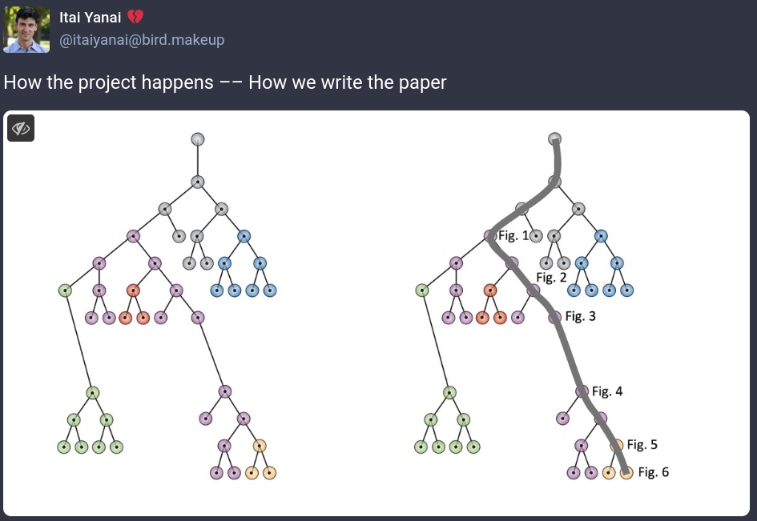

Source: https://github.com/markziemann/bioinformatics_intro_workshop


## The importance of data and code management

As a scientist, maintenance of our data and code are among our most crucial responsibilities.
Failing to do so can have dramatic consequences for our careers, our colleagues and for
the institue as a whole.

Do you know the minimum requirements for biomedical research data and code preservation in
Australia?

Let's take a look at the [NHMRC Management of Data and Information in Research guidelines](https://www.nhmrc.gov.au/sites/default/files/documents/attachments/Management-of-Data-and-Information-in-Research.pdf).

We won't write up a plan in today's session, but it should be something you should address
to remain in compliance with Burnet and funder guidelines.

Reflect on your past work from 5 years ago and tell me whether it is compliant with mandates.

Data management is also important for reproducibility.
Is your past computational work reproducible?

How do you think we can make our work more robust and reproducible?

Let's take a look at a blog post on this topic from Prof Altuna Akalin, a prominent
bioinformatician
([link](https://towardsdatascience.com/scientific-data-analysis-pipelines-and-reproducibility-75ff9df5b4c5)).

## A look at best practices

Some relatively simple rules we can adopt to enhance reproducibility of our work:

* [Ten Simple Rules for Reproducible Computational Research](https://journals.plos.org/ploscompbiol/article?id=10.1371/journal.pcbi.1003285)

* [Good enough practices in scientific computing](https://journals.plos.org/ploscompbiol/article?id=10.1371/journal.pcbi.1005510#sec009)

* [Ten Simple Rules for Creating a Good Data Management Plan](https://journals.plos.org/ploscompbiol/article?id=10.1371/journal.pcbi.1004525)

Conducting bioinformatics work on dedicated, on premises hardware is recommended.
Can you think of some reasons why that would be preferred?

## Organising your projects

What do you think is the best way to arrange your bioinformatics project folders?

Where to put different files including input data, sample sheets, documentations, scripts,
results?

## Data management

Let's take a look at the lifecycle of research project data.

* Plan, communicate, delegate

* Receive

* Check

* Document

* Back-up

* Storage, usage

* Disseminate

* Close

We will draft a data management plan later, but for now let's focus on the mechanics of
data handling on Linux systems.

## Receive data

There are different ways to receive bioinformatics data.
One way is over the internet with a variety of protocols.
It could be over https, ftp, sftp, scp, rsync or others.
It could be a physical hard drive.

The two most important approaches are `scp` and `rsync`.
`scp` is short for secure copy and is a version of `cp` that works over ssh.
`scp` is fairly easy to use, but is not suited to large files or unstable connections.
If a connection is interrupted, it will leave partial files.
If the command is repeated, it will attempt transfer of the entire dataset from the very
start.
Also, `scp` doesn't actually check that the transferred file isn't corrupted.
Still it is useful for small datasets.

When receiving data, we might use `scp` for transferring data between our PC and the
analysis server.
For this exercise, let's try transferring some data between computers of the HPC.
Consider the following command:

```
scp <yourusername>@bnt-hpcn-02:/home/mark.ziemann/public/100507_R*.fq.gz .

```

Works the same as this:

```
scp <yourusername>@10.11.10.158:/home/mark.ziemann/public/100507_R*.fq.gz .

```

Sometimes, the actual IP address is required if the hostname isn't known.

`rsync` is another option, better suited for large transfers.

```
rsync -ahv mark.ziemann@10.11.10.158:/home/mark.ziemann/public/100507_R*.fq.gz .

```

`rsync` is great because it checks the integrity of files, ensuring they aren't corrupted.
It checks the original and destination md5 checksums.
If the original and destination checksums are the same, then the file transfer is skipped.

## Checking data

It is a good idea to check your data integrity before analysing it.

A simple approach is to check the size of a file:

```
du -sh 100507_R*.fq.gz

```

But this has a subtle problem that the same file on different file systems can occupy a
different size.
For example data on a Windows formatted external HDD might use different number of bytes as
compared to a Linux drive.

This is why checksums are important.
They confirm the data in the file are the same or not.
Every file or piece of data can generate a checksum or a type of fingerprint, which is very
distinctive.
Two different files having the same checksum are very rare.

We can uset the `md5sum` command to obtain a checksum.

```
md5sum 100507_R*fq.gz

```

You can visually confirm the checksums if you only have a few files.

```
4037a30ff563c21f7ecaeeda1d3bd454  100507_R1.fq.gz
3f632f0417bfc15c10aee50907aeb586  100507_R2.fq.gz

```

But if you have more, an automatic solution is probably better.

Download the md5sums corresponding to the original files and check whether the newly created
files are the same.

```
wget https://ziemann-lab.net/public/tmp/checksums.md5

```

Then run `md5sum` in "check" mode.

```
md5sum -c checksums.md5

```

It should say "OK" for both files.

At this point you may want to run some further checks on the data, to validate that they
conform to standards, as errors may have been incorporated at an early phase after data was
collected.

For FASTQ files like this, we can look at the read length, number of reads for both files,
and check whether the file format conforms to FASTQ.

We can't simply run `head` on these files as they are, because they have been compressed.
Instead, try `zcat`

```
zcat 100507_R1.fq.gz | head

```

Get the read length using `sed`:

```
zcat 100507_R1.fq.gz | head | sed -n 2p
zcat 100507_R1.fq.gz | head | sed -n 2p | wc

```

Get the number of reads using sed, only printing the 2nd line for each sequence record.
Make sure both files have same read length.

```
zcat 100507_R1.fq.gz | head -20 | sed -n '2~4p'
zcat 100507_R1.fq.gz | sed -n '2~4p' | wc -l

```

Can you write an `if` statement to check the read numbers are the same for both files?

## Documenting data

Every project should have a README.
Let's discuss what it should contain.

1. For a large omics project at the initial stage, what sort of information should go in it?

2. How should the README change as a project moves from initial analysis towards publication?

## Backing up data

Which files should you back up or not?

It is important to understand the computing environment you are working in.
If you are working on a laptop, then that work probably isn't backed-up by default.
The Burnet HPC filesystem undergoes regular backups, so you can work there knowing that if
you lose data, you can request restoration of a snapshot (contact Shanon Loveridge or IT
without delay).
If you are working on a desktop computer, you may be able to work on a OneDrive file system,
which is backed up.
If you are using another drive on the PC, then you'll need to set up a backup.

On a Linux system, you can schedule `rsync` to run at certain times, like 2am Saturday with
`cron`.
You can edit your scheduled tasks using `crontab -e`

There are a plethora of [forums](https://unix.stackexchange.com/questions/392780/how-to-schedule-an-rsync-command) and other web resources on this, which I suggest you search
independently, but your crontab entry might look like this:

```
0 2 * * SAT rsync -a src dest

```

Another important consideration is that you need to regularly check that the backup worked
as expected, by checking log files and by trying to restore backed up files.

## Storage and usage

When it comes to actually doing your project, there is a risk that things go wrong and files
get deleted or overwritten.

This can be prevented by changing the permissions of files.
Permissions refer to the ability for owners, group members and others to write, read and
execute files and directories.

To see the current permissions of files, use the `ls -l` command to get the whole contents
of the folder or `ls -l file1 file2 fileN` for select files.

The results will be tabular and the first column shows the permissions.

For me, the code I see is `-rw-r--r--` which consists of 10 characters.
Let's look at the role of each character:

1. Directory or not?

2. Owner can read?

3. Owner can write?

4. Owner can execute?

5. Group members can read?

6. Group members can write?

7. Group members can execute?

8. Others can read?

9. Others can write?

10. Others can execute?

So the code I have indicated it is a normal file, not a directory, which is readable to
everyone on the system, but only the owner (me) can write it.

We can change permissions using `chmod`.

```
chmod 444 myfile # read only for everyone
chmod 555 myscript # read and executable for everyone
chmod 666 myfile # read and writable for everyone
chmod 777 myfile # read, writable and executable for everyone
chmod 644 myfile # read and write for me and read-only for everone else

```

Chmod 644 is probably the right permission if you are working alone, but if you are actively
collaborating with others, you may need to share write permissions in the project user group,
so 664 might be practical.

Keep in mind that making read-only doesn't protect against some operations.
For example you can still rename it or move it to another location, and deletion with
`rm -f` will still work.

To mititgate this, consider making files immutable using the `chattr` command.
It may require `sudo`, so may not be that useful for the HPC cluster.

```
chattr +i myfile # set immutable
lsattr -l myfile # check attributes
chattr -i myfile # remove immutable flag

```

## Disseminate

Data sharing is a key part of a successful research project.
One tip I can give is to carefully consider when to share data.
It may be in your benefit to share raw data it at an early stage, after the dataset is
considered complete, especially if you can place the dataset under embargo until the
corresponding paper gets published.
It provides an external "back-up" and if the project ends up never being completed, the
embargo period will end and the data will become public.

## Closing a project

Winding down a project can take a few phases, and the data management plan should be followed.
Identify the data you want to keep forever; this should include management documents like
ethics applications and decisions around authorship which should be part of your lab notebook
and able to be accessed by the intitution already.
Code should be considered a separate and special data form and will be stored permanently.
Identify the files that can be safely deleted.
This could include intermediate files which can be easily regenerated using the scripts.
If the work was published more than 5 years ago and the raw data is deposited to a
public repository, then it can be deleted.
Update the README with information on how to reproduce the findings.

## Managing code - enter version control

Research projects are complicated things, typically involving many types of experiments, data,
people and institutions.
Research work is also very unpredictable, problems emerge all the time and we typically
publish only a small fraction of the data/results we generate.



If you have worked in a team sharing a common data and analysis folder, you will know that
mistakes can happen with files and the codes can be lost.
To avoid code loss we might even have multiple versions of a script in the folder with
different names eg: myscript.sh, myscript2.sh, myscript2final.sh, etc.
This issue is even worse for collaborations where the project folder is not shared and the
researchers send eachother scripts and code over email or some other medium.
In short, research project code can get messy very quickly, increasing the chance for
mistakes.
This is a prime reason why version control systems were developed.
In particular, distributed version control has emerged as the industry standard for software
development because each collaborator has their own copy of the repository and they
contribute their changes to the main repository, from which the other contributors fetch the
latest changes.

![Distributed version control. (A) Each author has a copy of the repository where their contributions are committed before being pushed to the main central repository. (B) An example hypothetical git workflow history for a research project involving a team of three authors. Circles represent code commits. Path divergences create separate branches for independent development. Horizontal paths indicate code changes for a particular branch. Path convergences indicate where branch specific differences are incorporated into the main branch.](images/dvcs.png)

Even if you are working alone, DVCS provides several benefits:

* Cloud backup of files.

* Always know which version is current.

* Promotes good practices regarding documentation and testing.

* See how things have evolved over time.

* Can roll back to any of the previous states.

* Issue tracking is helpful for prioritisation of tasks.

DVCS are useful for coding and other areas as well such as documentation, learning materials,
websites and ebooks.

## Using git with GitHub

GitHub may be a good option for you if you intend to publish your code publicly, or
frequently collaborate with others outside the organisation.
GitHub is not considered a backup, so you will need to ensure your code is backed up
separately.
It is a good idea to regularly mirror the code to Burnet's GitLab (explained below).

**1. Make a GitHub account.**

**2. Add an SSH key.**
An SSH key can be generated using the command ([source](https://www.brandonchecketts.com/archives/its-2023-you-should-be-using-an-ed25519-ssh-key-and-other-current-best-practices)):

```
ssh-keygen -t ed25519 -f ~/.ssh/your-key-filename -C "your-key-comment"

```

Optional: Add a passphrase.

The your-key-filename.pub contains the public key, which is a few hundred characters to
be copied.

On GitHub, click on your "profile" -> "settings" -> "SSH and GPG keys" -> "New SSH key"

This will enable authorisation of code changes without needing to enter a passphrase.

Best practice is to change out SSH keys at least annually.

**3. Create a new repository**
Provide a name without spaces or special characters.
Personally, I use `snake_case`.
Give a description - explain the purpose of the repo in 1 sentence.
Make it public or private.
I'd recommend making it public unless you have intellectual property concerns.
Be sure not to upload any identifiable participant info.

For this toy example, we could make a repo that simply holds some of the commands related to
data management.

Always add a README file at this stage.

Optional: Add a `.gitignore` file, which is a list of file types that should always be ignored.
Personally I don't use `.gitignore` files as I am always very careful which files get added
and which do not.

Lastly, there's an option to select a licence.
There are many options here from very permissive to more restrictive.
If you don't want anyone else to use your code, you can assert copyright by omitting a
LICENCE.

Hit the create button and you will be brought to the repo public home page.

**4. Clone the repo**
Back at your bash command line, navigate to your working area.
For me, I like to keep by work in my `~/projects` folder.
Then type:

```
git clone <my_repo_name>
```

Substituting <my_repo_name> with the name of your actual repo.

At that point, the repo will be downloaded and you can `cd` into it.

**5. Make some modifications**
As this is just a simple test, we will make some changes to the README.
Use `nano` or another text editor to add some more explanation to the repo.
You can also create a new shell script and paste some of those commands we used earlier,
together with some comments about what they do.

Now we need to "add" these files.
Which is like setting track changes on.
You should be extremely selective with the files being added.
Only code and documentation.
No large data files, no results files, no folders.

```
git add README myscript.sh

```

**6. Commit the changes**
Next step is to "commit" these changes, which will update the local repo.
You will see that there is an option to add a message.
These can become pretty important, especially when working on a large repo with multiple
contributors.

```
git commit -m "added README and first script"

```

**7. Push the changes**
The modification we made is local, so GitHub and collaborators won't be able to see it yet.
Change it with `push`

```
git push origin main

```

Now go to GitHub and confirm the changes have propagated.

**8. When working on a team project, always use `git pull` before making any changes.**
It will prevent frustrations by making sure you have the most up-to-date codes upon which
you will make additional modifications.

**9. Add team mates as collaborators**
At the GitHub repo, under the "Settings" tab, you will see a side menu with "Collaborators".
Add your lab head and team mates to this repo.
You will need to know their alias or email address.

**10. Try out GitHub's issues feature**
Issues can include new work that needs to be done (ie: features), or problems that need to
be resolved (ie: bugs).
Issues can be used to manage the work items for a project as they can be allocated to a
person, and they capture the corresponding discussion.
Try raising an issue and allocating someone (or yourself) for an issue.
Each issue has a number (eg: `#56`), which can be referred to in commit messages.

Tip: `git commit -m "close #56 with bugfix" && git push origin main` will close issue 
`#56` automatically.

The above steps are 90% of how researchers use git and GitHub.
Naturally there are more advanced workflows for more complex projects that include
many branches, automatic code testing, pull requests, etc.
But you can learn that stuff later as you encounter such problems or need to upgrade
certain workflows.

## Using git with GitLab

Burnet has its own GitLab server to manage code.
It is a good idea to use GitLab if you are dealing with sensitive data, have intellectual
property concerns, or just want to keep your code away from large corporations.

First step is to raise an IT ticket to request access to GitLab.
Follow those instructions to set up 2FA.
Retain recovery codes in a safe place.

Like above, the first step is to add an SSH key.
Click on your personal icon and hit "Preferences", the side menu will show "SSH Keys".
Add the public key, and then proceed to use the workflow above, by:

1. Creating a new repository

2. Cloning the repository

3. Making some changes

4. Adding, committing and pushing

5. Adding collaborators

6. Using issues to manage work items

## Publishing code supporing your project

The 10 year challenge has shown the difficulty of reproducing work over long timeframes.
GitHub and GitLab may not exist in 10 years, due to the commercial viability of Microsoft
and Burnet IT facilities.
Therefore a more long-term repository is required:

* [Zenodo](zenodo.org) is a scientific data repository with support from CERN whose stated
goal is for >20 years of preservation.

* [Software Heritage](https://www.softwareheritage.org/) is an organisation whose sole purpose
is long term preservation of software, including research code.

* [Arweave Network](https://www.arweave.org/) is an experimental distributed network that
uses blockchain to incentivise permanent data storage.

## Homework

Start a repo for a new project write some docs and start adding some codes.

Learn how to use Markdown to make better documentation using a [cheatsheet](https://www.markdownguide.org/cheat-sheet/).

Use the internet to find out what the README should contain for a data science project.
