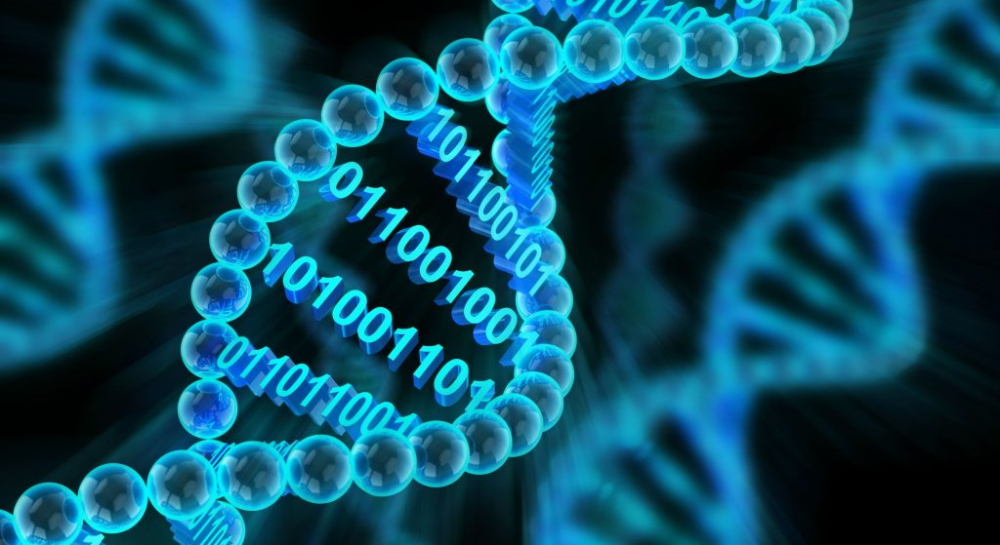

Source: https://github.com/markziemann/bioinformatics_intro_workshop



## The importance of data and code management

As a scientist, maintenance of our data and code are among our most crucial responsibilities.
Failing to do so can have dramatic consequences for our careers, our colleagues and for
the institue as a whole.

Do you know the minimum requirements for biomedical research data and code preservation in
Australia?

Reflect on your past work from 5 years ago and tell me whether it is compliant with mandates.

Is your past computational work reproducible?

How do you think we can make our work more robust and reproducible?

Let's take a look at a blog post on this topic from Prof Altuna Akalin, a prominent
bioinformatician
([link](https://towardsdatascience.com/scientific-data-analysis-pipelines-and-reproducibility-75ff9df5b4c5)).

## A look at best practices

Some relatively simple rules we can adopt to enhance reproducibility of our work:

* [Ten Simple Rules for Reproducible Computational Research](https://journals.plos.org/ploscompbiol/article?id=10.1371/journal.pcbi.1003285)

* [Good enough practices in scientific computing](https://journals.plos.org/ploscompbiol/article?id=10.1371/journal.pcbi.1005510#sec009)

Conducting bioinformatics work on dedicated, on premises hardware is recommended.
Can you think of some reasons why that would be preferred?

## Organising your projects

What do you think is the best way to organise your bioinformatics project folders?

## Data management

Let's take a look at the lifecycle of research project data.

* Plan, communicate, delegate

* Receive

* Check

* Document

* Back-up

* Storage, usage

* Validate back-up

* Disseminate

* Close

We will draft a data management plan later, but for now let's focus on the mechanics of
data handling on Linux systems.

### Receive data

There are different ways to receive bioinformatics data.
One way is over the internet with a variety of protocols.
It could be over https, ftp, sftp, scp, rsync or others.
It could be a physical hard drive.

The two most important approaches are `scp` and `rsync`.
`scp` is short for secure copy and is a version of `cp` that works over ssh.
`scp` is fairly easy to use, but is not suited to large files or unstable connections.
If a connection is interrupted, it will leave partial files.
If the command is repeated, it will attempt transfer of the entire dataset from the very
start.
Also, `scp` doesn't actually check that the transferred file isn't corrupted.
Still it is useful for small datasets.

When receiving data, we might use `scp` for transferring data between our PC and the
analysis server.
For this exercise, let's try transferring some data between computers of the HPC.
Consider the following command:

```
scp <yourusername>@bnt-hpcn-02:/home/mark.ziemann/public/100507_R*.fq.gz .

```

Works the same as this:

```
scp <yourusername>@10.11.10.158:/home/mark.ziemann/public/100507_R*.fq.gz .

```

Sometimes, the actual IP address is required if the hostname isn't known.

`rsync` is another option, better suited for large transfers.

```
rsync -ahv mark.ziemann@10.11.10.158:/home/mark.ziemann/public/100507_R*.fq.gz .

```

